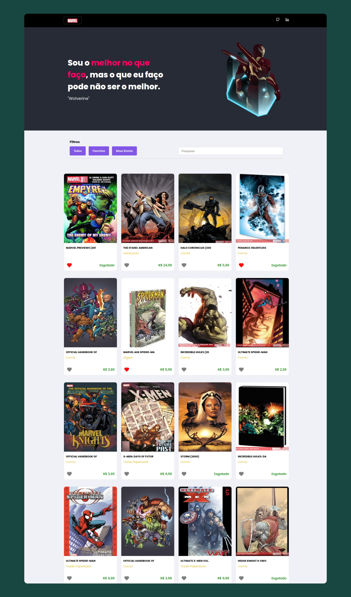

# Marvel Api - integrada a Api Google Maps

O projeto Marvel Api, foi um desafio proposto pela empresa BrisaNet, o objetivo deste projeto foi para medir meus conhecimentos em relação a áreas de desenvolvimento front-end, este projeto consiste em uma single-page application (SPA) que exibe uma lista cards (Comics), trazidos da Marvel Api. O usuário que utiliza a aplicação pode marcar e desmarcar card como favorito, visualizar mais informações de um card especifico, tem a opção de selecionar um card e cadastrar informações de endereço para envio através do "click" em um endereço no mapa em tempo real, com integração a api Google Maps, também é possível filtrar seus cards favoritos, pesquisar um card pelo nome e visualizar seu cards cadastrados para envio. Para isto foi utilizado ReactJs, javascript, css e html.

Este projeto foi iniciado com [Create React App](https://github.com/facebook/create-react-app).

## Scripts Disponíveis

No diretório do projeto, você pode executar:

### `npm install`

Para instalar as depedências do projeto.

### `npm start`

Executa o aplicativo no modo de desenvolvimento.\
Abrir [http://localhost:3000](http://localhost:3000) para visualizá-lo em seu navegador.

A página será recarregada quando você fizer alterações.

## Sobre o projeto 

### :hotsprings: Habilidades 

As seguintes habilidades que foram utilizadas na construção do projeto:

- Manipulação CSS
- Manipulação HTML
- Manipulação JavaScript
- Manipulação ReactJs
- Integração com Api's externas

### 🛠 Tecnologias

As seguintes ferramentas que foram utilizadas na construção do projeto:

- [Html](https://htmlreference.io/)
- [Css](https://developer.mozilla.org/pt-BR/docs/Web/CSS)
- [JavaScript](https://developer.mozilla.org/pt-BR/docs/Web/javascript)
- [ReactJs](https://pt-br.reactjs.org/)
- [Vscode](https://code.visualstudio.com/)

### Api's integradas 

Api's que tiveram integração neste projeto foram:

- [Marvel-Api](https://developer.marvel.com/)
- [Google-Maps](https://developers.google.com/maps)
- [Google-Maps-Geolocation](https://developers.google.com/maps/documentation/geolocation/overview)

### 🚀 Bibliotecas 

As seguintes bibliotecas foram utilizadas na construção do projeto:

- [Aos] Biblioteca de Animação
- [ReactIcons] Biblioteca de icones
- [Axios] Cliente HTTP baseado-em-promessas

### :movie_camera: Previwer do projeto.

<h1 align="center" >
  
</h1>

